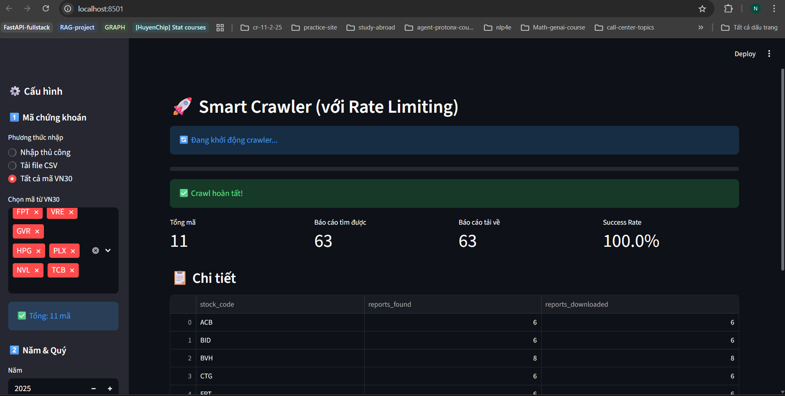

# 🚀 Smart Vietstock Crawler - Trình thu thập báo cáo tài chính thông minh

Đây là một công cụ được xây dựng bằng Python và Streamlit để tự động tải xuống các báo cáo tài chính từ website Vietstock.vn. Công cụ được trang bị giao diện người dùng thân thiện, dễ sử dụng cùng các tính năng thông minh như tự động giới hạn tốc độ (rate limiting), chia lô (batching) để đảm bảo quá trình tải ổn định và không bị chặn.



## ✨ Tính năng nổi bật

*   **Giao diện người dùng trực quan:** Được xây dựng bằng Streamlit, giúp người dùng dễ dàng thao tác và tùy chỉnh.
*   **Nhiều phương thức nhập mã chứng khoán:**
    *   Nhập thủ công.
    *   Tải lên từ file CSV.
    *   Chọn trực tiếp từ danh sách VN30.
*   **Rate Limiting thông minh:** Tự động điều chỉnh tốc độ yêu cầu để tránh bị chặn bởi máy chủ.
*   **Xử lý lô thông minh (Smart Batching):** Tự động chia nhỏ danh sách cổ phiếu lớn thành các lô nhỏ hơn để xử lý, giảm thiểu lỗi và tăng độ ổn định.
*   **Ghi log chi tiết:** Mọi hoạt động, lỗi và cảnh báo đều được ghi lại vào file log để dễ dàng theo dõi và gỡ lỗi.
*   **Tổ chức file khoa học:** Các báo cáo tải về được tự động lưu vào các thư mục được đặt tên theo mã chứng khoán, quý và năm.
*   **Thống kê chi tiết:** Hiển thị kết quả tổng quan sau khi hoàn tất (tổng số báo cáo tìm thấy, đã tải về, tỷ lệ thành công).
*   **Tùy chỉnh nâng cao:** Cho phép người dùng tinh chỉnh các tham số như số lượng yêu cầu mỗi phút, số mã tối đa mỗi lô.

## 📦 Cài đặt

Để chạy được dự án này, bạn cần có Python 3.8 trở lên.

### 1. Tạo và kích hoạt môi trường ảo

Môi trường ảo giúp cô lập các thư viện của dự án này với các dự án khác trên máy tính của bạn.

Mở Terminal (hoặc Command Prompt trên Windows) và chạy các lệnh sau:

**Tạo môi trường ảo:**
```bash
python -m venv .venv
```

**Kích hoạt môi trường ảo:**

*   **Trên Windows:**
    ```bash
    .\.venv\Scripts\activate
    ```
*   **Trên macOS/Linux:**
    ```bash
    source .venv/bin/activate
    ```

Sau khi kích hoạt, bạn sẽ thấy `(.venv)` ở đầu dòng lệnh trong terminal.

### 2. Cài đặt các thư viện cần thiết

Tất cả các thư viện yêu cầu đã được liệt kê trong file `requirement.txt`. Chạy lệnh sau để cài đặt:
```bash
pip install -r requirement.txt
```

## 🏃‍♂️ Cách chạy ứng dụng

Sau khi đã cài đặt xong, đảm bảo bạn vẫn đang ở trong môi trường ảo (`.venv`), chạy lệnh sau để khởi động ứng dụng Streamlit:
```bash
streamlit run app_preview.py
```
Ứng dụng sẽ tự động mở trong trình duyệt của bạn với một địa chỉ local, thường là `http://localhost:8501`.

## ⚙️ Hướng dẫn sử dụng và tùy chỉnh giao diện (UI)

Giao diện chính của ứng dụng được đặt ở thanh bên (sidebar) bên trái. Dưới đây là giải thích chi tiết các tùy chọn:

### 1️⃣ Mã chứng khoán

Đây là nơi bạn cung cấp danh sách các mã cổ phiếu cần tải báo cáo.

*   **Nhập thủ công:**
    *   Chọn tùy chọn "Nhập thủ công".
    *   Nhập các mã chứng khoán vào ô text, mỗi mã cách nhau bởi dấu phẩy (ví dụ: `FPT, VCB, HPG`).
    *   **Khuyến nghị:** Nên nhập dưới 20 mã mỗi lần để đạt hiệu suất tốt nhất.

*   **Tải file CSV:**
    *   Chọn tùy chọn "Tải file CSV".
    *   Chuẩn bị một file CSV có một cột tên là `stock_code`, chứa danh sách các mã chứng khoán.
    *   Nhấn nút "Browse files" và chọn file CSV của bạn.

*   **Tất cả mã VN30:**
    *   Chọn tùy chọn "Tất cả mã VN30".
    *   Một danh sách các mã trong rổ VN30 sẽ hiện ra. Bạn có thể chọn một, nhiều hoặc tất cả các mã mình muốn.

### 2️⃣ Năm & Quý

*   **Năm:** Nhập năm bạn muốn tải báo cáo tài chính.
*   **Chọn quý:** Chọn một hoặc nhiều quý (1, 2, 3, 4) bạn muốn tải.

### ⚙️ Cài đặt nâng cao

Phần này cho phép bạn tinh chỉnh hoạt động của crawler để phù hợp với nhu cầu.

*   **Max mã mỗi batch:**
    *   **Chức năng:** Quy định số lượng mã chứng khoán tối đa sẽ được xử lý trong một lô. Nếu tổng số mã bạn nhập vào lớn hơn con số này, ứng dụng sẽ tự động chia thành nhiều lô nhỏ và có một khoảng nghỉ giữa các lô.
    *   **Tùy chỉnh:** Kéo thanh trượt để chọn giá trị từ 5 đến 50. Giá trị mặc định là 20. Giảm con số này nếu bạn gặp lỗi kết nối thường xuyên.

*   **Max requests/phút:**
    *   **Chức năng:** Giới hạn số lượng yêu cầu (requests) mà crawler gửi đến máy chủ Vietstock trong một phút. Đây là tính năng cốt lõi để tránh bị chặn IP.
    *   **Tùy chỉnh:** Kéo thanh trượt để chọn giá trị từ 10 đến 60. Giá trị mặc định là 30. Nếu bạn có đường truyền mạng không ổn định, hãy giảm con số này xuống.

### ⏱️ Thời gian ước tính

Dựa trên số lượng mã và số quý bạn chọn, ứng dụng sẽ đưa ra một ước tính sơ bộ về thời gian cần thiết để hoàn thành.

### 🚀 Bắt đầu Crawl

Sau khi đã cấu hình xong, nhấn nút **"Bắt đầu Crawl"** để khởi động quá trình. Bạn có thể theo dõi tiến trình qua thanh trạng thái và các thông báo trên giao diện chính.

## 📁 Cấu trúc thư mục sau khi chạy

Sau khi quá trình crawl hoàn tất, các file sẽ được lưu với cấu trúc như sau:
```
.
├── BATCH_YYYYMMDD_HHMMSS/
│   ├── STOCKCODE_Q1_YYYY/
│   │   ├── metadata.json
│   │   ├── STOCKCODE_Q1_YYYY.csv
│   │   └── report_file_1.pdf
│   │   └── ...
│   ├── STOCKCODE_Q2_YYYY/
│   │   └── ...
│   ├── SUMMARY_REPORT.csv
│   └── batch_stats.json
└── logs/
    └── crawler_YYYYMMDD_HHMMSS.log
```
*   **BATCH_.../**: Thư mục chính chứa kết quả của một lần chạy.
*   **STOCKCODE_Qx_YYYY/**: Thư mục con chứa báo cáo của một mã cổ phiếu trong một quý cụ thể.
*   **metadata.json**: Chứa thông tin thô (metadata) về các báo cáo được tìm thấy.
*   **...csv**: File CSV tóm tắt các file đã tải xuống trong thư mục đó.
*   **...pdf**: File báo cáo tài chính đã được tải về.
*   **SUMMARY_REPORT.csv**: Báo cáo tổng hợp kết quả của toàn bộ lô.
*   **logs/crawler_...log**: File log ghi lại toàn bộ quá trình hoạt động, rất hữu ích cho việc gỡ lỗi.